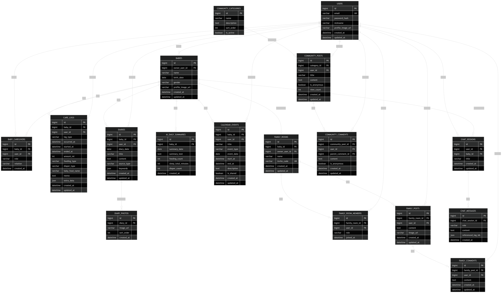
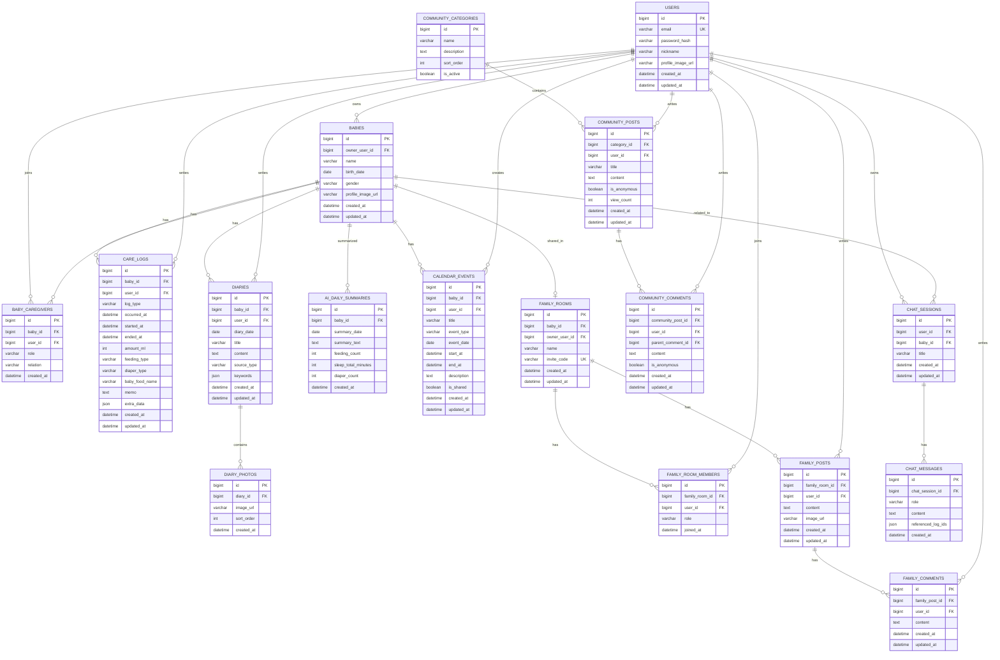

# BabyLog MVP ERD



## 1. 설계 기준

본 ERD는 AI 기반 신생아 육아 관리 플랫폼의 MVP 범위를 기준으로 설계한다.

MVP 포함 기능은 다음과 같다.

* 회원가입 / 로그인 / 로그아웃
* 홈 화면
* 육아 기록
* AI 일기 생성
* 캘린더
* 가족방
* 커뮤니티
* AI 챗봇

초기 MVP에서는 포토북, 쇼핑, 전문가 상담, 고급 AI 분석, 실시간 영상 상담은 제외한다.

---

## 2. 핵심 엔티티

```text
User
- 앱 사용자, 보호자, 가족 구성원

Baby
- 관리 대상 아기

CareLog
- 수유, 수면, 소변, 대변, 이유식 기록

Diary
- 직접 작성 또는 AI가 생성한 육아 일기

CalendarEvent
- 예방접종, 병원 방문, 가족 일정 등 캘린더 일정

FamilyRoom
- 가족이 함께 아기 기록을 공유하는 공간

Community
- 보호자들이 고민, 정보, 경험을 공유하는 공간

Chatbot
- AI 육아 상담 대화 기록
```

---

## 3. Mermaid ERD



---

## 4. 테이블 상세 설명

### 4.1 users

앱 사용자를 저장한다. 보호자, 가족 구성원, 커뮤니티 작성자 모두 `users` 테이블을 사용한다.

| 컬럼 | 타입 | 설명 |
| --- | --- | --- |
| id | BIGINT | 사용자 PK |
| email | VARCHAR | 로그인 이메일 |
| password_hash | VARCHAR | 암호화된 비밀번호 |
| nickname | VARCHAR | 닉네임 |
| profile_image_url | VARCHAR | 프로필 이미지 |
| created_at | DATETIME | 생성일 |
| updated_at | DATETIME | 수정일 |

---

### 4.2 babies

아기 정보를 저장한다.

| 컬럼 | 타입 | 설명 |
| --- | --- | --- |
| id | BIGINT | 아기 PK |
| owner_user_id | BIGINT | 아기 소유 사용자 |
| name | VARCHAR | 아기 이름 |
| birth_date | DATE | 생년월일 |
| gender | VARCHAR | 성별 |
| profile_image_url | VARCHAR | 아기 프로필 이미지 |
| created_at | DATETIME | 생성일 |
| updated_at | DATETIME | 수정일 |

---

### 4.3 care_logs

수유, 수면, 소변, 대변, 이유식 기록을 통합 저장한다.

| 컬럼 | 타입 | 설명 |
| --- | --- | --- |
| id | BIGINT | 기록 PK |
| baby_id | BIGINT | 아기 ID |
| user_id | BIGINT | 작성자 ID |
| log_type | VARCHAR | FEEDING, SLEEP, URINE, STOOL, BABY_FOOD |
| occurred_at | DATETIME | 기록 발생 시각 |
| started_at | DATETIME | 시작 시각 |
| ended_at | DATETIME | 종료 시각 |
| amount_ml | INT | 수유량 |
| feeding_type | VARCHAR | 모유, 분유 등 |
| diaper_type | VARCHAR | 소변, 대변 상태 |
| baby_food_name | VARCHAR | 이유식 이름 |
| memo | TEXT | 메모 |
| extra_data | JSON | 수유 시간·좌우·트림, 수면 종류·상태, 배뇨/배변 양·색상·형태·사진 URL |
| created_at | DATETIME | 생성일 |
| updated_at | DATETIME | 수정일 |

`log_type` 예시:

```text
FEEDING
SLEEP
URINE
STOOL
BABY_FOOD
```

MVP 입력 규칙:

| 기록 | 필수 입력 | 선택 입력 |
| --- | --- | --- |
| 수유 | 시간, 방식, 수유량 또는 수유 시간 | 좌우, 트림, 메모 |
| 수면 | 시작 시간, 종료 시간 | 낮잠/밤잠, 상태 |
| 소변 | 시간 | 양, 색상 |
| 대변 | 시간 | 양, 색상, 형태, 사진 URL |

---

### 4.4 diaries

직접 작성한 일기 또는 AI가 생성한 일기를 저장한다.

| 컬럼 | 타입 | 설명 |
| --- | --- | --- |
| id | BIGINT | 일기 PK |
| baby_id | BIGINT | 아기 ID |
| user_id | BIGINT | 작성자 ID |
| diary_date | DATE | 일기 날짜 |
| title | VARCHAR | 제목 |
| content | TEXT | 본문 |
| source_type | VARCHAR | MANUAL, AI |
| keywords | JSON | 산책, 낮잠, 목욕 등 선택 키워드 |
| created_at | DATETIME | 생성일 |
| updated_at | DATETIME | 수정일 |

---

### 4.5 diary_photos

일기에 첨부된 사진을 저장한다.

| 컬럼 | 타입 | 설명 |
| --- | --- | --- |
| id | BIGINT | 사진 PK |
| diary_id | BIGINT | 일기 ID |
| image_url | VARCHAR | 이미지 URL |
| sort_order | INT | 정렬 순서 |
| created_at | DATETIME | 생성일 |

---

### 4.6 ai_daily_summaries

하루 기록 기반 AI 요약 결과를 저장한다.

| 컬럼 | 타입 | 설명 |
| --- | --- | --- |
| id | BIGINT | AI 요약 PK |
| baby_id | BIGINT | 아기 ID |
| summary_date | DATE | 요약 날짜 |
| summary_text | TEXT | AI 요약 문장 |
| feeding_count | INT | 수유 횟수 |
| sleep_total_minutes | INT | 총 수면 시간 |
| diaper_count | INT | 배변/기저귀 횟수 |
| created_at | DATETIME | 생성일 |

제약 조건:

```text
UNIQUE(baby_id, summary_date)
```

---

### 4.7 calendar_events

캘린더에 표시할 일정을 저장한다.

| 컬럼 | 타입 | 설명 |
| --- | --- | --- |
| id | BIGINT | 일정 PK |
| baby_id | BIGINT | 아기 ID |
| user_id | BIGINT | 작성자 ID |
| title | VARCHAR | 일정 제목 |
| event_type | VARCHAR | VACCINATION, HOSPITAL, FAMILY, ETC |
| event_date | DATE | 일정 날짜 |
| start_at | DATETIME | 시작 시각 |
| end_at | DATETIME | 종료 시각 |
| description | TEXT | 설명 |
| is_shared | BOOLEAN | 가족방 공유 여부 |
| created_at | DATETIME | 생성일 |
| updated_at | DATETIME | 수정일 |

---

### 4.8 family_rooms

가족방 정보를 저장한다.

| 컬럼 | 타입 | 설명 |
| --- | --- | --- |
| id | BIGINT | 가족방 PK |
| baby_id | BIGINT | 연결된 아기 ID |
| owner_user_id | BIGINT | 가족방 생성자 |
| name | VARCHAR | 가족방 이름 |
| invite_code | VARCHAR | 초대 코드 |
| created_at | DATETIME | 생성일 |
| updated_at | DATETIME | 수정일 |

제약 조건:

```text
UNIQUE(invite_code)
```

---

### 4.9 family_room_members

가족방 구성원을 저장한다.

| 컬럼 | 타입 | 설명 |
| --- | --- | --- |
| id | BIGINT | PK |
| family_room_id | BIGINT | 가족방 ID |
| user_id | BIGINT | 사용자 ID |
| role | VARCHAR | ADMIN, MEMBER |
| joined_at | DATETIME | 입장일 |

제약 조건:

```text
UNIQUE(family_room_id, user_id)
```

---

### 4.10 family_posts

가족방 피드 게시글을 저장한다.

| 컬럼 | 타입 | 설명 |
| --- | --- | --- |
| id | BIGINT | 가족방 게시글 PK |
| family_room_id | BIGINT | 가족방 ID |
| user_id | BIGINT | 작성자 ID |
| content | TEXT | 게시글 내용 |
| image_url | VARCHAR | 이미지 URL |
| created_at | DATETIME | 생성일 |
| updated_at | DATETIME | 수정일 |

---

### 4.11 family_comments

가족방 게시글 댓글을 저장한다.

| 컬럼 | 타입 | 설명 |
| --- | --- | --- |
| id | BIGINT | 댓글 PK |
| family_post_id | BIGINT | 가족방 게시글 ID |
| user_id | BIGINT | 작성자 ID |
| content | TEXT | 댓글 내용 |
| created_at | DATETIME | 생성일 |
| updated_at | DATETIME | 수정일 |

---

### 4.12 community_categories

커뮤니티 게시판 카테고리를 저장한다.

| 컬럼 | 타입 | 설명 |
| --- | --- | --- |
| id | BIGINT | 카테고리 PK |
| name | VARCHAR | 카테고리 이름 |
| description | TEXT | 설명 |
| sort_order | INT | 정렬 순서 |
| is_active | BOOLEAN | 활성 여부 |

초기 카테고리 예시:

```text
임신 게시판
출산 후기
조리원 정보
신생아 게시판
수유 & 이유식
건강 & 병원
수면 & 발달
자유게시판
고민 상담 게시판
```

---

### 4.13 community_posts

커뮤니티 게시글을 저장한다.

| 컬럼 | 타입 | 설명 |
| --- | --- | --- |
| id | BIGINT | 게시글 PK |
| category_id | BIGINT | 카테고리 ID |
| user_id | BIGINT | 작성자 ID |
| title | VARCHAR | 제목 |
| content | TEXT | 본문 |
| is_anonymous | BOOLEAN | 익명 여부 |
| view_count | INT | 조회수 |
| created_at | DATETIME | 생성일 |
| updated_at | DATETIME | 수정일 |

---

### 4.14 community_comments

커뮤니티 댓글을 저장한다.

| 컬럼 | 타입 | 설명 |
| --- | --- | --- |
| id | BIGINT | 댓글 PK |
| community_post_id | BIGINT | 게시글 ID |
| user_id | BIGINT | 작성자 ID |
| parent_comment_id | BIGINT | 대댓글 부모 댓글 ID |
| content | TEXT | 댓글 내용 |
| is_anonymous | BOOLEAN | 익명 여부 |
| created_at | DATETIME | 생성일 |
| updated_at | DATETIME | 수정일 |

---

### 4.15 chat_sessions

AI 챗봇 대화 세션을 저장한다.

| 컬럼 | 타입 | 설명 |
| --- | --- | --- |
| id | BIGINT | 채팅 세션 PK |
| user_id | BIGINT | 사용자 ID |
| baby_id | BIGINT | 관련 아기 ID |
| title | VARCHAR | 대화 제목 |
| created_at | DATETIME | 생성일 |
| updated_at | DATETIME | 수정일 |

---

### 4.16 chat_messages

AI 챗봇 메시지를 저장한다.

| 컬럼 | 타입 | 설명 |
| --- | --- | --- |
| id | BIGINT | 메시지 PK |
| chat_session_id | BIGINT | 채팅 세션 ID |
| role | VARCHAR | USER, ASSISTANT, SYSTEM |
| content | TEXT | 메시지 내용 |
| referenced_log_ids | JSON | 답변에 참고한 기록 ID 목록 |
| created_at | DATETIME | 생성일 |

---

## 5. MVP에서 제외하는 테이블

초기 MVP에서는 다음 기능을 테이블로 만들지 않는다.

```text
experts
consultations
products
orders
vaccination_schedules
growth_reports
photo_books
notifications
```

이 기능들은 향후 확장 시 별도 테이블로 추가한다.

---

## 6. 주요 관계 요약

```text
users 1 : N babies

babies 1 : N care_logs
babies 1 : N diaries
babies 1 : N calendar_events
babies 1 : 1 family_rooms

family_rooms 1 : N family_room_members
family_rooms 1 : N family_posts
family_posts 1 : N family_comments

community_categories 1 : N community_posts
community_posts 1 : N community_comments

users 1 : N chat_sessions
chat_sessions 1 : N chat_messages
```

---

## 7. 설계 의도

### 7.1 기록 테이블을 care_logs 하나로 통합한 이유

수유, 수면, 소변, 대변, 이유식은 기록 방식은 다르지만 공통적으로 다음 정보를 가진다.

```text
아기
작성자
기록 유형
발생 시간
메모
생성일
수정일
```

따라서 MVP에서는 별도 테이블을 여러 개 만들기보다 `care_logs` 하나로 관리하고, `log_type`으로 기록 종류를 구분한다.

이 방식은 빠른 개발에 유리하고, 홈 화면의 오늘 요약이나 AI 요약 생성에도 데이터를 모으기 쉽다.

### 7.2 가족방과 아기를 연결한 이유

가족방은 특정 아기의 육아 기록을 함께 공유하는 공간이다.
따라서 `family_rooms`는 `baby_id`를 가진다.

### 7.3 AI 결과를 별도 저장하는 이유

AI 일기와 AI 요약은 호출 비용이 있고, 같은 결과를 반복해서 생성할 필요가 없다.
따라서 AI가 생성한 결과를 `diaries`, `ai_daily_summaries`, `chat_messages`에 저장한다.

### 7.4 캘린더 데이터 기준

캘린더 화면은 다음 데이터를 함께 보여준다.

```text
care_logs
diaries
calendar_events
```

즉, `calendar_events`는 사용자가 직접 등록한 일정이고, 기록과 일기는 날짜 기준으로 함께 조회해서 캘린더에 표시한다.
